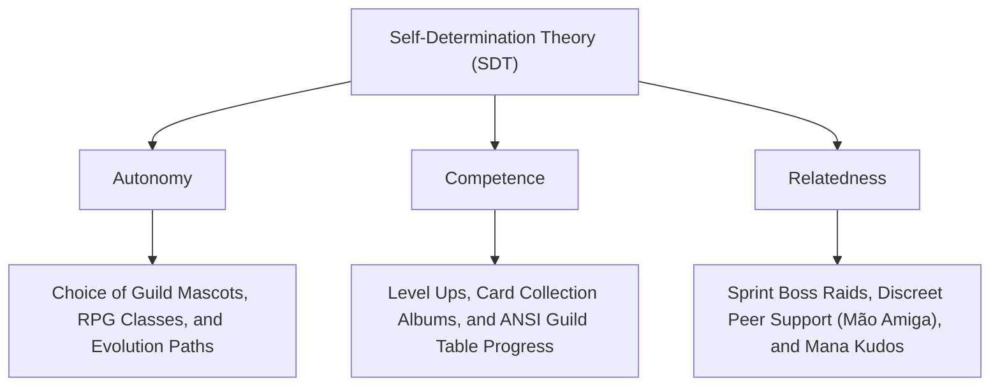
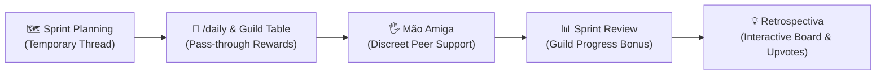

# 💣 BOMB: Gamification Master Plan (GMP / PGG)

> **Strategic, Scientific, and Architectural Document of the Gamification and Engagement System for BOMB**

---

## 🎯 1. Overview & Strategic Objectives

### The Operational Problem
In university teams, junior enterprises, and technology squads, traditional agile rituals (such as the *Daily Standup*) frequently degrade:
- **Cold Status Reports:** Members complete forms solely out of bureaucratic obligation.
- **Silent Blockers:** Developers conceal impediments due to embarrassment or fear of micromanagement (*Fear Tax*), delaying sprint deliverables.
- **Abstention & Decreased Consistency:** Lack of immediate feedback causes response rates to plummet after the first week.
- **High Cognitive Overhead:** Legacy bots require members to memorize 15+ text slash commands (`/album`, `/profile`, `/rescue`), causing severe user fatigue.

### The BOMB Solution
**BOMB** resolves this friction by transforming the asynchronous routine into a cooperative journey on Discord, where daily standups power an ecosystem of **collective progress, evolvable mascots, discreet peer support, collectible card drops, and sprint boss battles**—all operated via **Passive 1-Click UI (Buttons, Modals, Select Menus, and the Guild Table Message Hub)**.

```
                       ┌─────────────────────────────────────────┐
                       │          PASSIVE GAMIFICATION CYCLE     │
                       └────────────────────┬────────────────────┘
                                            │
        ┌───────────────────────────────────┼───────────────────────────────────┐
        ▼                                   ▼                                   ▼
 ┌──────────────┐                   ┌──────────────┐                   ┌──────────────┐
 │ Guild Table  │                   │ Modal Form   │                   │ Pass-through │
 │ Persistent   │  ──────────────►  │ 1-Click      │  ──────────────►  │ Quest Log    │
 │ ANSI Message │                   │ Fill         │                   │ Rewards      │
 └──────────────┘                   └──────────────┘                   └──────────────┘
```

#### Engagement Goals:
1. **Increase Daily Consistency:** Maintain standup response rates above **85%** throughout the entire sprint.
2. **Accelerate Blocker Resolution:** Reward team members who raise and assist in resolving impediments.
3. **Strengthen Social Belonging & Psychological Safety:** Shift focus from punitive leadership to a culture of mutual aid (*Mão Amiga*) and peer kudos without public embarrassment.
4. **Zero Psychological Overhead:** Eliminate CLI text command friction, embedding gamification seamlessly into the developer's Discord routine.

---

## 🧬 2. Scientific Foundation & Market Research

### 2.1 Self-Determination Theory (SDT) — Ryan & Deci
BOMB is engineered to satisfy the three fundamental psychological needs of human motivation:



### 2.2 Octalysis Framework — Yu-kai Chou
Mapping of the 8 Core Drives of Human Motivation in BOMB:
- **Core 1 (Epic Meaning & Calling):** Unite with the guild to defeat the Sprint Boss and safeguard expedition goals.
- **Core 2 (Development & Accomplishment):** Level up, evolve adventurer classes, and complete the Card Album.
- **Core 3 (Empowerment of Creativity & Feedback):** Combine class passives and mascot auras with team strategies.
- **Core 4 (Ownership & Possession):** Collect rare cards and nurture the Guild Mascot.
- **Core 5 (Social Influence & Relatedness):** Give and receive *Mana Kudos*, extend discreet peer help (*Mão Amiga*).
- **Core 6 (Scarcity & Impatience):** Standup submission windows open with defined deadlines.
- **Core 7 (Unpredictability & Curiosity):** Post-daily random drops of card packs (Common, Rare, Epic, Shiny).
- **Core 8 (Loss & Avoidance Mitigation):** Streak protection shields prevent demotivation caused by single accidental misses.

---

### 2.3 Elite Product Benchmark

We analyzed product mechanics from top retention applications globally:

| Platform | Analyzed Mechanic | Application in BOMB |
|---|---|---|
| **Duolingo** | *Friend Quests & Streaks* | **Battle Buddies:** Sprint duos earning bonus XP when submitting on the same day with 1-click reminders. |
| **Finch & KUBBO** | *Digital Pet & Care* | **Guild Mascot:** Server pets gaining XP and visually evolving based on daily team participation. |
| **Habitica** | *Party Boss & Shared Damage* | **Boss Raid & Rescue:** Sprint deliverables calculate Boss HP. Dailies deal direct damage to the Boss. |
| **Strava** | *Kudos Economy* | **Mana Kudos:** Interactive buttons (`[ 👏 Kudos ]`) below daily reports transferring +10 XP to authors. |
| **Pokétwo / Monopoly GO** | *Collectible Card Packs* | **Card Albums:** Card pack envelopes dropped automatically upon daily submission. |

---

## 🎨 3. Aesthetics & Tone of Voice

BOMB adopts a **lighthearted, direct, and humorous fantasy aesthetic**, inspired by the visual style of *Adventure Time* and *Pit People*:
- **Zero Friction & No Forced Humor:** Interface is clean, presenting data via ANSI terminal blocks in Discord without awkward dialogues.
- **Vibrant ANSI Terminal Colors:** Styled Discord codeblocks featuring progress bars, mascot status, and expedition logs.

---

## ⚙️ 4. Detailed System Mechanics

### 4.1 RPG Class Tree & Hexad Profiles
Members select or evolve their classes based on behavioral profiles (Hexad Framework):

```
Tier 1 (Level 1)       Tier 2 (Level 5)           Tier 3 (Level 15)
----------------   ---------------------   -------------------------
🍀 Gobbo --------> 🪽 Angel Gobbo ---------> 👼 Angel (XP Crit + Streak Shield)
🗡️ Spearman -----> 🌻 Sunflower Knight ----> 🧟‍♂️ Undead Shieldsman (Early Bird Bonus)
🩹 Healer -------> 🌿 Druid --------------> 🦋 Moth Mage (Zero-Blocker Bonus)
🐾 Beast Tamer --> 🏹 Beast Huntress -----> ✨ Lightbringer (Synergy Bonus)
🐮 Mooladin -----> ⛓️ Iron Mooladin -------> 😈 Heretic Mooladin (Streak Multiplier)
✂️ Scissorpaw ----> 🤺 Dashing Fencer -----> 🦊 Fox Musketeer (Blocker Slice Bonus)
```

---

### 4.2 Guild Mascots
Selectable by the leader during the 1-click `/bomb setup` wizard, applying server-wide active auras:

1. 🚗 **Transformer Bug (Fusca Transformer):** +25% XP on morning standup submissions.
2. 👶 **Sphinx Pup:** +20% XP for detailed blocker disclosures.
3. 🍞 **Loaf Kaiju:** Protection against streak loss on short delays.
4. 🦆 **Voodoo Rubber Duck:** +15% XP bonus on team Kudos and reactions.
5. 🌵 **Literally a Cactus:** +20% XP multiplier on long active streaks.
6. 🦝 **Prospector Raccoon:** Increased drop rate for Epic & Shiny collectible cards.

---

### 4.3 Collectible Card Album
- **Post-Daily Drops:** Submitting a daily standup automatically draws a card.
- **Rarity Distribution:** Common (60%), Rare (30%), Epic (8%), Shiny (2%).
- **Ephemeral Viewing:** Click `[ 🧙 Ficha & Cards ]` on the Guild Table to view card inventory privately without public spam.

---

### 4.4 Sprint Boss Raid & Party Rescue
- **Boss HP Formula:** `Total_Members × Sprint_Days × 100`.
- **Attacks:** Each submitted daily deals direct damage to the Sprint Boss. Resolving blockers dispatches critical hits.
- **Discreet Rescue:** Teammates can extend help (`🖐️ Mão Amiga`) to protect a partner's streak.

---

### 4.5 Mana Kudos (Peer Validation)
- Interactive buttons (`[ 👏 Kudos (+10 XP) ]`) placed directly underneath published Quest Logs.
- Clicking a Kudo transfers **+10 XP** to the daily author and records social motivation stats.

---

### 4.6 Psychological Safety & Agile Ceremonies

#### A. Discreet Peer Support ("Mão Amiga")
- **The Problem:** In traditional rituals, developers hide impediments or task completions due to social anxiety or fear of micromanagement (*Fear Tax*).
- **The Solution:** The `[ 🖐️ Mão Amiga ]` button on the Guild Table, `/help_me`, and right-click Context Menus (`🖐️ Solicitar Mão Amiga`) allow members to discreetly signal or offer support.
- **Prosocial Rewards:** Members who offer assistance receive the **"Mão Amiga" Badge** and **+25 Prosocial XP**, leveraging *Reciprocal Altruism (Trivers, 1971)*.



---

## 🛠️ 5. Technical & Database Architecture

### 5.1 Command Consolidation (3 Slash Commands & 2 Context Menus)
- `/bomb`: Subcommands `table` (Guild Table message hub) and `setup` (1-click leader wizard).
- `/daily`: Direct modal opener for asynchronous daily standups.
- `/help_me`: Complete guild manual guide & discreet help trigger.
- Context Menus: `🖐️ Solicitar Mão Amiga` (Message & User context actions).

### 5.2 Resilient Guild Table Queue (`guildTableQueueService`)
- Memory-queued **1.5s debouncing** with concurrency locks per project.
- Prevents race conditions and Discord HTTP 429 Rate Limits during peak daily submission hours.

### 5.3 Web Dashboard Readiness (Supabase PostgreSQL Schema)
- Structured storage of `raw_payload JSONB`, `discord_user_id`, and `discord_guild_id` across `dailies`, `planned_tasks`, `retrospective_items`, and `impediments`.
- Persistent `guild_tables` table mapping channel and message IDs for server restarts.

---

## 🎯 Conclusion

The **Gamification Master Plan (GMP / PGG)** bridges behavioral psychology (SDT, Octalysis, Fogg Model), zero-friction UX design, and robust TypeScript engineering on Discord.js v14. **BOMB** empowers technology teams to maintain peak daily consistency, eliminate administrative fatigue, and thrive in a collaborative agile environment.
