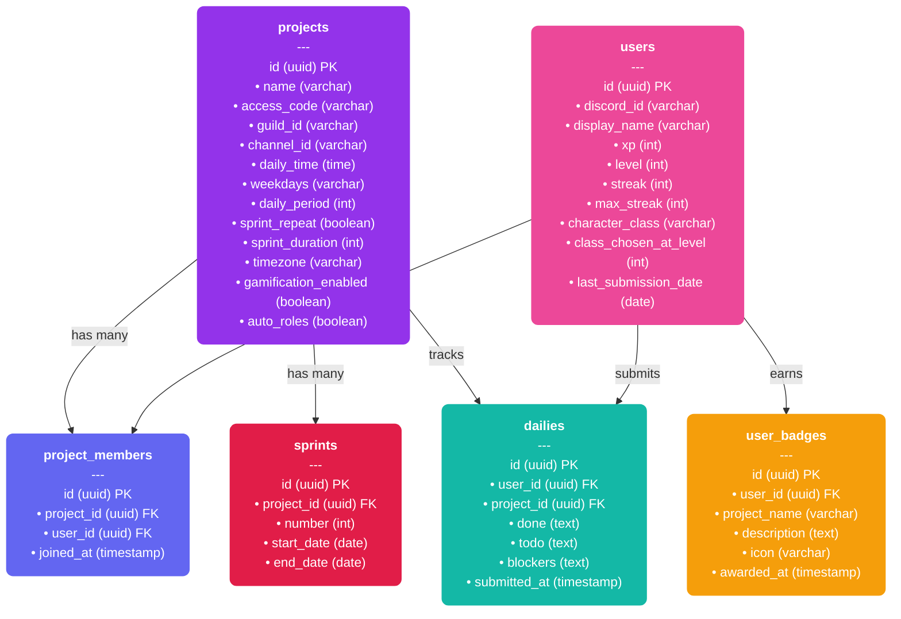

<div align="center">

# 💣 BOMB

**Automated async standups & RPG gamification right inside your Discord server.**

*The name is an inside joke but the results are for real though.*

[](https://discord.js.org)
[](https://typescriptlang.org)
[](https://supabase.com)
[](LICENSE)

---

**BOMB** automates agile daily standups for university teams, junior enterprises, and small squads with a cute RPG adventure twist.
No more chasing teammates for updates. The bot collects, formats, and publishes everything in one clean quest log report while rewarding team consistency with XP, levels, class evolutions, and Discord roles.

[Getting Started](#-getting-started) · [Commands](#-commands) · [RPG Gamification](#-rpg-gamification) · [Architecture](#-architecture) · [Roadmap](#-roadmap)

</div>

---

## 🎯 Why BOMB Exists

Agile ceremonies often fall apart in student and volunteer-led teams. 

> *"We'll just sync on WhatsApp"* quickly turns into missed deadlines, silent blockers, and last-minute panic.

**The common pitfalls:**
- **Manual follow-ups:** Leaders waste hours micromanaging and chasing team members for basic status updates.
- **Silent struggles:** Team members hide blockers and fail to claim tasks, delaying group progress. Feeling lost within the project, they ultimately stop contributing.
- **Zero visibility:** The team operates in the dark until the day before delivery.
- **Skipped rituals:** Traditional standups are hard to schedule and easily ignored.

**BOMB replaces the friction.** By pinging your team directly inside Discord with an automated, 30-second async form, BOMB ensures that everyone stays aligned. Blockers are raised without pressure, leaders get a consolidated report delivered right to the channel, and team members earn XP, streaks, and RPG class evolutions for their daily contributions. 


---

## 🤖 How It Works


| Step | What happens |
|---|---|
| **1. Register** | Leader creates a project — members join with an invite code and choose an initial RPG Adventurer Class |
| **2. Schedule** | Leader sets the days & time for automated standup reminders |
| **3. Collect** | Bot pings the channel — members click a button and fill a quick Discord modal *(what I did / what I'll do / blockers)* |
| **4. Publish** | Bot compiles all answers into an ANSI-styled Quest Log, calculates XP & Streaks, applies class passives, and handles Level Ups / Class Evolutions |

---

## 🛠️ Getting Started

### Prerequisites

- **Node.js** ≥ 18
- A [Discord Application](https://discord.com/developers/applications) with a bot token
- A [Supabase](https://supabase.com) project (free tier works)

### Setup

```bash
# 1. Clone & install
git clone https://github.com/EduLoboM/BOMB.git
cd BOMB
npm install

# 2. Configure environment
cp .env.example .env
```

Fill in your `.env`:

```env
DISCORD_TOKEN=your_bot_token
CLIENT_ID=your_app_client_id
GUILD_ID=your_test_server_id
SUPABASE_URL=https://your-project.supabase.co
SUPABASE_KEY=your_service_key
```

```bash
# 3. Run database migrations, deploy slash commands & start
npm run migration
npm run deploy
npm run dev
```

---

## ⌨️ Commands

All commands use Discord's native **Slash Commands** (`/`).

| Command | Who | Description |
|---|---|---|
| `/create_project [name]` | 🔑 Leader | Create a new project in the current server |
| `/join_project [code]` | 👤 Member | Join an existing project by invite code and pick your RPG Adventurer Class |
| `/project_status` | 👤 Anyone | View project config, members, active sprint status & guild dashboard |
| `/setup_channel [#channel]` | 🔑 Leader | Set the channel for daily standup quest logs |
| `/setup_daily [time] [days] [period] [timezone]` | 🔑 Leader | Schedule standup reminders and set the open period (e.g. `10:00`, `mon,tue,wed`, `1h30m`). You can also provide an optional timezone offset (e.g. `-3`) or IANA name |
| `/setup_sprint [start] [days] [repeat]` | 🔑 Leader | Define sprint start date, duration, and toggle automatic sprint repetition when it ends |
| `/sprint_repeat [enabled]` | 🔑 Leader | Enable or disable automatic sprint repetition at any time |
| `/setup_roles [auto_roles] [gamification]` | 🔑 Leader | Toggle the RPG gamification system and automatic Discord role sync for adventurer classes |
| `/finish_project` | 🔑 Leader | Finish and permanently delete the project for this server, awarding project completion badges to all members |
| `/daily` | 👤 Anyone | Manually open the daily modal (only works if the daily window is currently open) |
| `/profile [user]` | 👤 Anyone | View adventurer character sheet, XP progress bar, active streak, class passives & earned badges |
| `/leaderboard` | 👤 Anyone | View the guild leaderboard ranked by XP and daily standup streaks |
| `/class [select]` | 👤 Anyone | View adventurer class tree, check passive abilities, and evolve your class upon leveling up |

---

## 🛡️ RPG Gamification System

BOMB transforms daily standups into a cute medieval adventure game to boost engagement and team consistency.

### Adventurer Classes & Evolutions

Members start as a **Gobbo** (or choose a Tier 1 base class upon joining) and evolve into powerful advanced classes as they level up:

| Class Line | Tier 1 (Base) | Tier 2 (Level 5) | Tier 3 (Level 15) | Passive Ability |
|---|---|---|---|---|
| **Gobbo** 🍀 | Gobbo | Angel Gobbo 🪽 | Angel 👼 | Critical Hit chance for 2.0x Double XP + Streak Shield |
| **Spearman** 🗡️ | Spearman | Sunflower Knight 🌻 | Zombie Shieldman 🧟‍♂️ | Early Bird XP bonus for submitting standups first |
| **Healer** 🩹 | Healer | Druid 🌿 | Moth Mage 🦋 | Bonus XP for submitting standups with zero blockers |
| **Beast Tamer** 🐾 | Beast Tamer | Beast Huntress 🏹 | Lightbringer ✨ | Bonus XP for detailed updates & full team participation |
| **Mooladin** 🐮 | Mooladin | — | Heretic Mooladin 😈 | Daily Streak XP multiplier boost (up to 1.6x) |
| **Scissorpaw** ✂️ | Scissorpaw | — | Fox Musketeer 🦊 | High Critical Hit chance + Blocker Slice XP bonus |

### Automatic Discord Roles
When enabled via `/setup_roles`, BOMB automatically creates and assigns server roles matching each member's active adventurer class (e.g. `🍀 Gobbo`, `🪽 Angel Gobbo`, `👼 Angel`).

---

## 📐 Architecture

```
BOMB/
├── tests/                   # Automated unit tests (Vitest)
│   ├── commands.test.ts
│   ├── dateUtils.test.ts
│   ├── gamificationService.test.ts
│   ├── handlers.test.ts
│   ├── reportUtils.test.ts
│   ├── schedulers.test.ts
│   └── services.test.ts
├── src/
│   ├── commands/            # Discord slash commands definitions
│   │   ├── class.ts
│   │   ├── commandInterface.ts
│   │   ├── createProject.ts
│   │   ├── daily.ts
│   │   ├── finishProject.ts
│   │   ├── index.ts
│   │   ├── joinProject.ts
│   │   ├── leaderboard.ts
│   │   ├── profile.ts
│   │   ├── projectStatus.ts
│   │   ├── setupChannel.ts
│   │   ├── setupDaily.ts
│   │   ├── setupRoles.ts
│   │   ├── setupSprint.ts
│   │   └── sprintRepeat.ts
│   ├── handlers/            # Interaction and event handlers
│   │   └── interactionHandler.ts
│   ├── scheduler/           # Standup cron scheduler service
│   │   └── standupScheduler.ts
│   ├── services/            # Supabase database access layer
│   │   ├── dailyService.ts
│   │   ├── gamificationService.ts
│   │   ├── projectService.ts
│   │   ├── sprintService.ts
│   │   └── userService.ts
│   ├── utils/               # Date utilities, report compilers & theme
│   │   ├── dateUtils.ts
│   │   ├── reportUtils.ts
│   │   └── theme.ts
│   ├── clearDb.ts           # DB Cleanup helper
│   ├── deployCommands.ts    # Slash commands registry builder
│   ├── env.ts               # Environment variables helper
│   ├── index.ts             # Main entrypoint and bot initializer
│   ├── logger.ts            # Custom console logger helper
│   ├── migration.sql        # Database migration SQL queries
│   ├── migration.ts         # DB Migration runner script
│   ├── schema.sql           # Database schema SQL commands
│   ├── supabase.ts          # Supabase client initializer
│   └── types.ts             # Global TS types definitions
├── .env                     # Environment variables
├── package.json
└── tsconfig.json
```

### Tech Stack

| Layer | Technology |
|---|---|
| **Runtime** | Node.js + TypeScript |
| **Discord SDK** | discord.js v14 |
| **Database** | Supabase (PostgreSQL) |
| **Test Runner** | Vitest |
| **Dev Server** | tsx (watch mode) |

### Database Schema (Supabase)



---

## 🚧 Roadmap

- [x] Core bot scaffold with discord.js v14
- [x] Slash command deployment
- [x] Interactive modal for daily responses
- [x] Supabase integration for persistent data
- [x] Scheduled daily reminders (cron)
- [x] Formatted standup reports in channel
- [x] Gamification — Streaks, XP system, RPG Class Evolutions, Discord role rewards
- [ ] Blocker Dashboard — Visual board for impediments + auto-notify senior devs
- [ ] Planning, Review and Retrospective Module — Planning of tasks and events, review of tasks and events and retrospectives of tasks and events.

---

## 🧑‍💻 Contributing

Contributions are welcome! Feel free to open an **Issue** or submit a **Pull Request**.

---

<div align="center">

**Built with 💣 by university students who got tired of chasing teammates.**

</div>