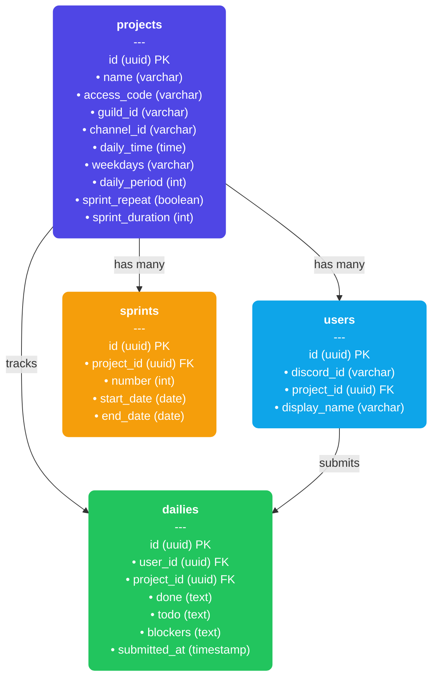

<div align="center">

# 💣 BOMB

**The name was an inside joke but the results are for real though.**

*Automated async standups right inside your Discord server.*

[](https://discord.js.org)
[](https://typescriptlang.org)
[](https://supabase.com)
[](LICENSE)

---

**BOMB** automates agile daily standups for university teams, junior enterprises, and small squads.
No more chasing teammates for updates. The bot collects, formats, and publishes everything in one clean report.

[Getting Started](#-getting-started) · [Commands](#-commands) · [Architecture](#-architecture) · [Roadmap](#-roadmap)

</div>

---

## 🧩 Why BOMB Exists

> It's 11 PM. Deadline is tomorrow. You open the group chat and ask *"how's everyone doing?"* — silence.
> Two hours later someone replies in a DM: *"sorry, I've been stuck since Tuesday but didn't want to bother anyone."*

**Sound familiar?** In university projects and junior enterprises, the same pattern repeats:

- The **leader** wastes hours chasing people one-by-one for updates they'll never get on time
- The **members** silently struggle with blockers they're too embarrassed to raise in front of the group and desappear from the project
- Nobody **knows** what anyone else is actually working on until the night before delivery and the last day everyone runs like it's a 100m dash
- Standup meetings get **skipped** because *"we'll just sync on WhatsApp"* and then nobody does

BOMB breaks this cycle. Instead of relying on social pressure or manual follow-ups, it creates a **low-friction, private, async ritual** — a 30-second form that runs on autopilot. Everyone reports, nobody is exposed, and the leader sees the full picture without asking a single question.

---

## ⚡ How It Works


| Step | What happens |
|---|---|
| **1. Register** | Leader creates a project — members join with an invite code |
| **2. Schedule** | Leader sets the days & time for automated standup reminders |
| **3. Collect** | Bot pings the channel — members click a button and fill a quick Discord modal *(what I did / what I'll do / blockers)* |
| **4. Publish** | Bot compiles all answers into a clean, formatted report posted to the team channel |

---

## 🚀 Getting Started

### Prerequisites

- **Node.js** ≥ 18
- A [Discord Application](https://discord.com/developers/applications) with a bot token
- A [Supabase](https://supabase.com) project (free tier works)

### Setup

```bash
# 1. Clone & install
git clone https://github.com/EduLoboM/BOMB.git
cd BOMB
npm install

# 2. Configure environment
cp .env.example .env
```

Fill in your `.env`:

```env
DISCORD_TOKEN=your_bot_token
CLIENT_ID=your_app_client_id
GUILD_ID=your_test_server_id
SUPABASE_URL=https://your-project.supabase.co
SUPABASE_KEY=your_anon_key
```

```bash
# 3. Deploy slash commands & run
npm run deploy
npm run dev
```

---

## 📋 Commands

All commands use Discord's native **Slash Commands** (`/`).

| Command | Who | Description |
|---|---|---|
| `/create_project [name]` | 🔑 Leader | Create a new project in the current server |
| `/join_project [code]` | 👤 Member | Join an existing project by invite code |
| `/project_status` | 👤 Anyone | View project config, members & sprint status (falls back to N/A if not configured) |
| `/setup_channel [#channel]` | 🔑 Leader | Set the channel for daily reports |
| `/setup_daily [time] [days] [period]` | 🔑 Leader | Schedule standup reminders and set the open period (e.g. `10:00`, `mon,tue,wed`, `1h30m`). Submissions outside this window will be blocked |
| `/setup_sprint [start] [days] [repeat]` | 🔑 Leader | Define sprint start date, duration, and toggle automatic sprint repetition when it ends |
| `/sprint_repeat [enabled]` | 🔑 Leader | Enable or disable automatic sprint repetition at any time |
| `/finish_project` | 🔑 Leader | Finish and permanently delete the project for this server (with confirmation prompt) |
| `/daily` | 👤 Anyone | Manually open the daily modal (only works if the daily window is currently open) |

---

## 🏗 Architecture

```
BOMB/
├── tests/                   # Automated unit tests (Vitest)
│   ├── dateUtils.test.ts
│   └── reportUtils.test.ts
├── src/
│   ├── commands/            # Discord slash commands definitions
│   │   ├── commandInterface.ts
│   │   ├── createProject.ts
│   │   ├── daily.ts
│   │   ├── index.ts
│   │   ├── joinProject.ts
│   │   ├── projectStatus.ts
│   │   ├── setupChannel.ts
│   │   ├── setupDaily.ts
│   │   ├── setupSprint.ts
│   │   ├── sprintRepeat.ts
│   │   └── finishProject.ts
│   ├── handlers/            # Interaction and event handlers
│   │   └── interactionHandler.ts
│   ├── scheduler/           # Standup cron scheduler service
│   │   └── standupScheduler.ts
│   ├── services/            # Supabase database access layer
│   │   ├── dailyService.ts
│   │   ├── projectService.ts
│   │   ├── sprintService.ts
│   │   └── userService.ts
│   ├── utils/               # Date utilities and report compilers
│   │   ├── dateUtils.ts
│   │   └── reportUtils.ts
│   ├── deployCommands.ts    # Slash commands registry builder
│   ├── index.ts             # Main entrypoint and bot initializer
│   ├── logger.ts            # Custom console logger helper
│   ├── schema.sql           # Database schema SQL commands
│   └── supabase.ts          # Supabase client initializer
├── .env                     # Environment variables
├── package.json
└── tsconfig.json
```

### Tech Stack

| Layer | Technology |
|---|---|
| **Runtime** | Node.js + TypeScript |
| **Discord SDK** | discord.js v14 |
| **Database** | Supabase (PostgreSQL) |
| **Dev Server** | tsx (watch mode) |

### Database Schema (Supabase)



---

## 🗺 Roadmap

- [x] Core bot scaffold with discord.js v14
- [x] Slash command deployment
- [x] Interactive modal for daily responses
- [x] Supabase integration for persistent data
- [x] Scheduled daily reminders (cron)
- [x] Formatted standup reports in channel
- [ ] Gamification — Streaks, XP system, Discord role rewards
- [ ] Blocker Dashboard — Visual board for impediments + auto-notify senior devs
- [ ] Planning, Review and Retrospective Module — Planning of tasks and events, review of tasks and events and retrospectives of tasks and events.

---

## 🤝 Contributing

Contributions are welcome! Feel free to open an **Issue** or submit a **Pull Request**.

---

<div align="center">

**Built with 💣 by university students who got tired of chasing teammates.**

</div>